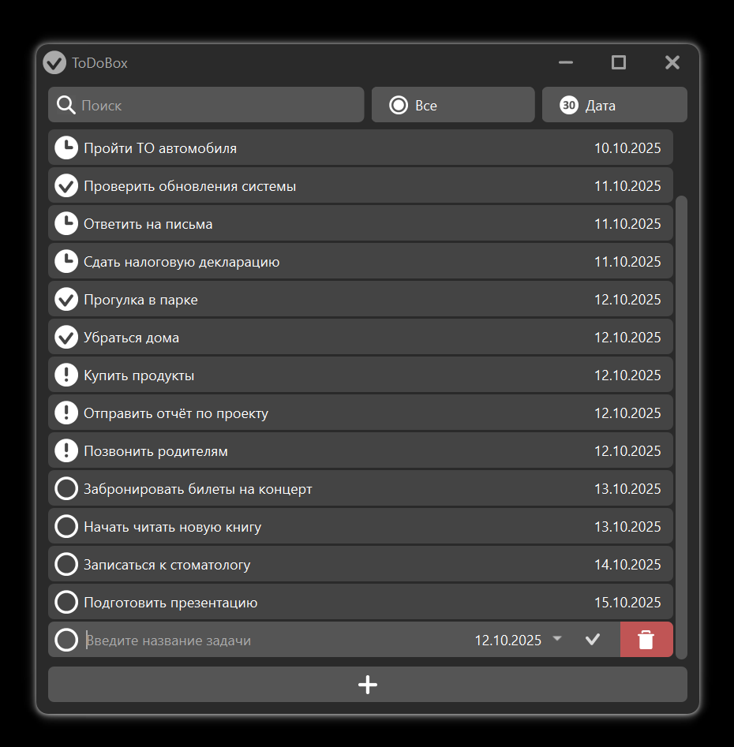

# ✅ ToDoBox

Простое десктоп-приложение для ведения списка задач. Создано на **C++ / Qt 6**.



---

## 🚀 Возможности

- Добавление задач с датой
- Отображение статуса: `Сегодня`, `Просрочено`, `Запланировано`, `Выполнено`
- Сортировка:
  - По дате
  - По статусу
  - По алфавиту
- Фильтрация задач по статусу и названию
- Сохранение задач между сессиями
- Темная минималистичная тема интерфейса
- Поддержка drag-and-drop для изменения порядка

---

## 🛠️ Технологии

- **Qt 6.9.2**
- **C++17**
- CMake + Ninja (или QMake, если адаптируешь)
- Custom widgets (`EditingWidget`, `ApprovedWidget`, `TopWidget`, и др.)
- `QListWidget`, `QComboBox`, `QPushButton`, и т.д.

---

## 🔧 Сборка проекта

### Требования

- Qt 6.x (тестировалось на 6.9.2)
- CMake 3.16+
- Компилятор MinGW (или MSVC)
- Ninja (опционально, но быстрее)

### Инструкция

```bash
git clone https://github.com/M4e4/ToDoBox.git
cd ToDoBox
mkdir build
cd build
cmake .. -G "Ninja" -DCMAKE_BUILD_TYPE=Release
cmake --build .